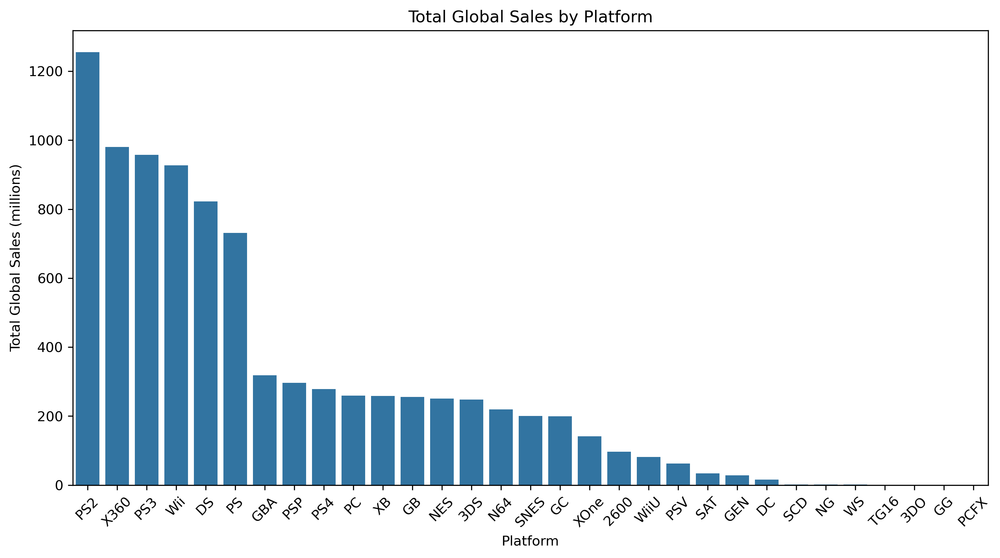
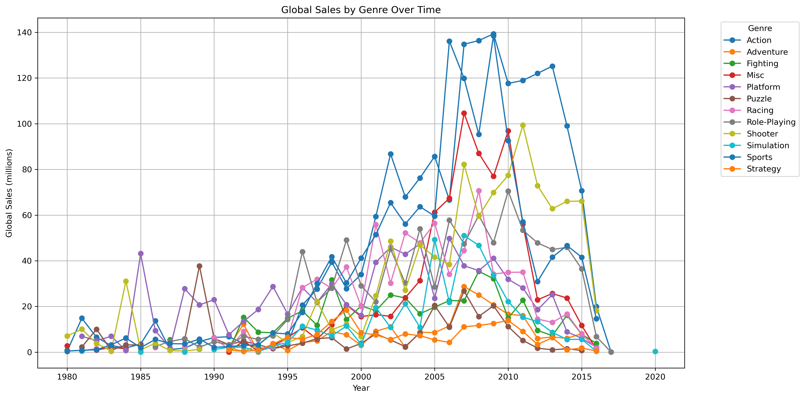
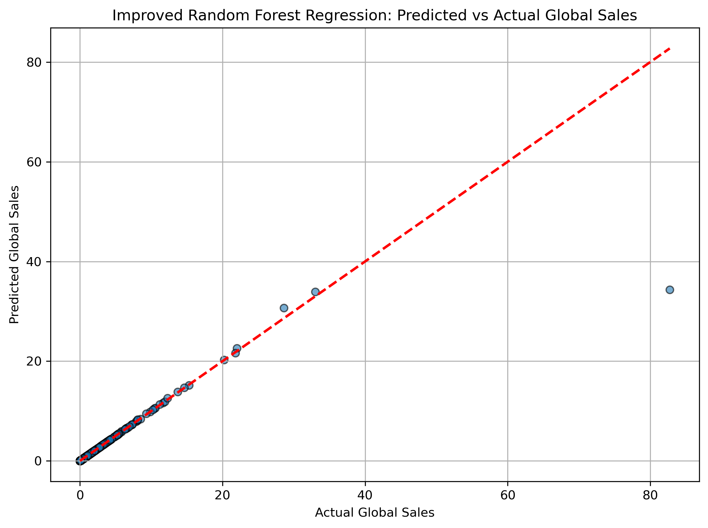

# Global Video Game Sales Analysis

This project performs an end-to-end exploratory data analysis (EDA) and predictive modeling on a global video game sales dataset. The objective is to uncover insights about sales trends across platforms, genres, and regions, and to build a machine learning model that can predict global sales based on various game attributes.

---

## Dataset

- **Source**: [Kaggle - Video Game Sales](https://www.kaggle.com/datasets/gregorut/videogamesales)
- **Size**: ~16,500 records
- **Features**:
  - Name, Platform, Year of Release
  - Genre, Publisher
  - Critic and User Scores
  - Regional Sales (NA, EU, JP, Others)
  - Global Sales (target variable)

---

## Project Objectives

- Clean and preprocess the dataset
- Explore trends in sales by genre, platform, publisher, year, and region
- Visualize insights using Python plotting libraries
- Train machine learning models to predict global sales
- Compare model performances and select the best one

---

## Data Cleaning & Preprocessing

- Removed missing values and duplicates
- Standardized column formats
- One-hot encoded categorical variables for modeling
- Applied log-transformation to target variable to improve regression stability

---

## Exploratory Data Analysis (EDA)

The dataset was explored using visual and statistical methods to understand market dynamics.

### Total Global Sales by Platform


### Global Sales by Genre Over Time


Key observations:
- Console platforms such as PS2, PS3, and Xbox 360 dominate global sales.
- Action, Sports, and Shooter genres are the most commercially successful.
- Sales peaked around 2008 and declined post-2010.

---

## Predictive Modeling

Three models were trained and evaluated:
1. **Linear Regression** – Baseline model
2. **Random Forest Regressor** – Untuned
3. **Improved Random Forest** – Trained on log-transformed global sales

### Final Model: Improved Random Forest (Log-Transformed)

- Provided the most accurate predictions
- Handled skewed target distribution effectively
- Outperformed the baseline models significantly

### Predicted vs Actual Global Sales


---

## Results & Insights

- The final model explained ~83% of the variance in global sales.
- Sales performance is highly influenced by platform, genre, and critic scores.
- Predictive modeling is feasible and useful for estimating a game's commercial success.

---

## Project Structure

├── Global_Video_Game_Sales_Analysis.ipynb
├── vgsales.csv
├── images/
│ ├── sales_by_platform.png
│ ├── genre_over_time.png
│ └── rf_predictions.png
├── README.md

---

## How to Run

1. Clone the repository:
   ```bash
   git clone https://github.com/ayan978/Global-Video-Game-Sales-Analysis.git
   cd Global-Video-Game-Sales-Analysis

2. Launch the notebook:
jupyter notebook Global_Video_Game_Sales_Analysis.ipynb


